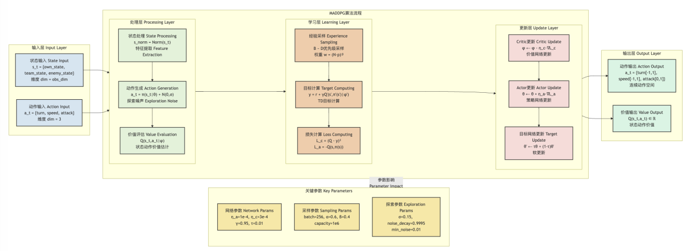
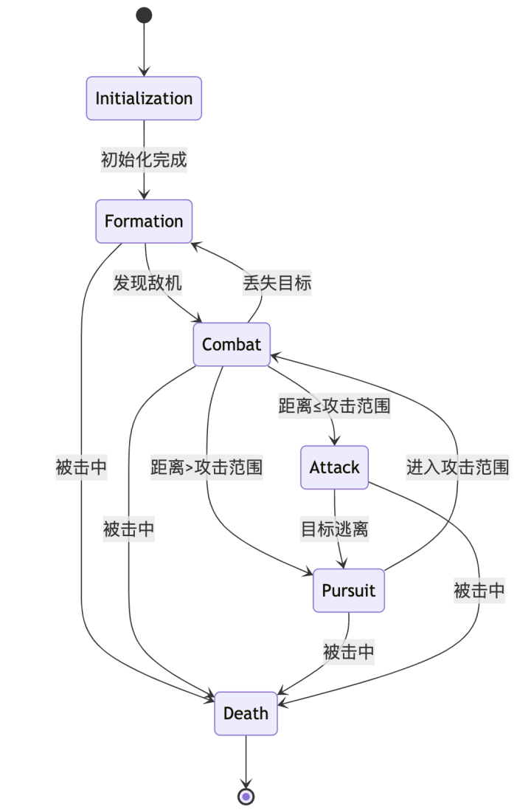
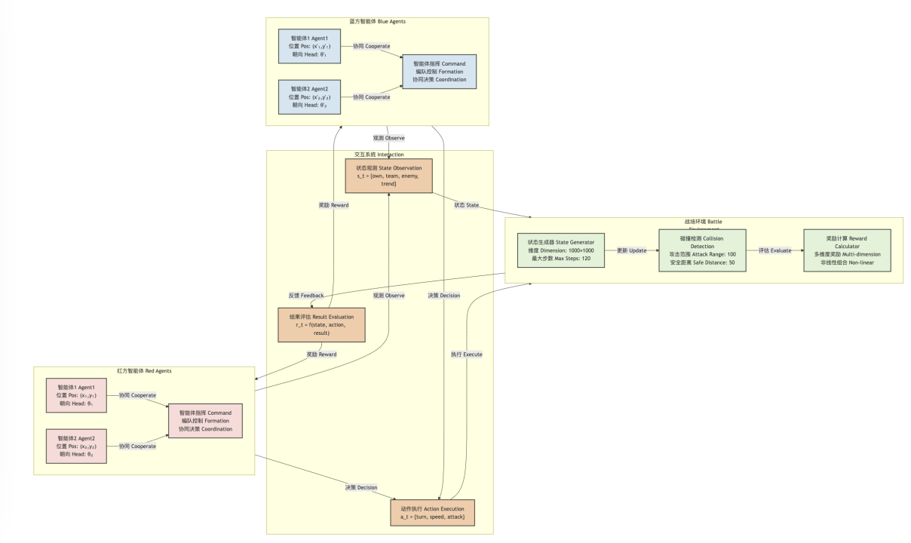
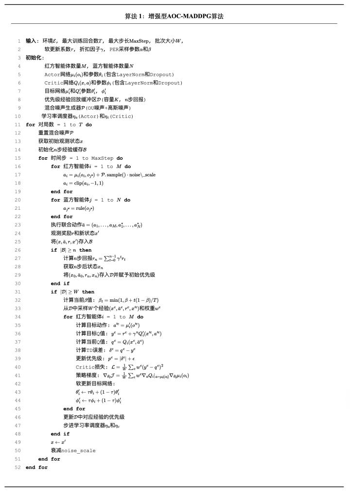
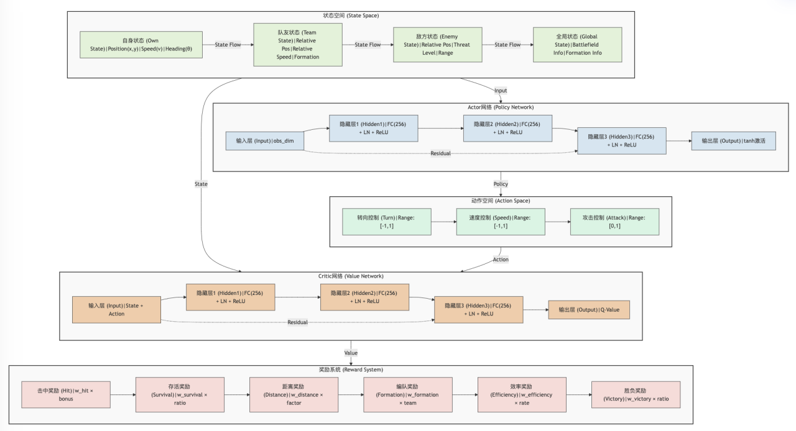
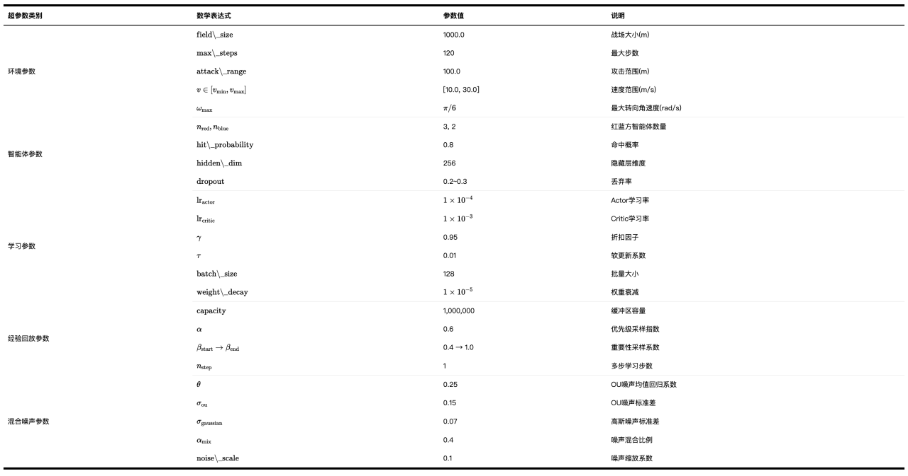
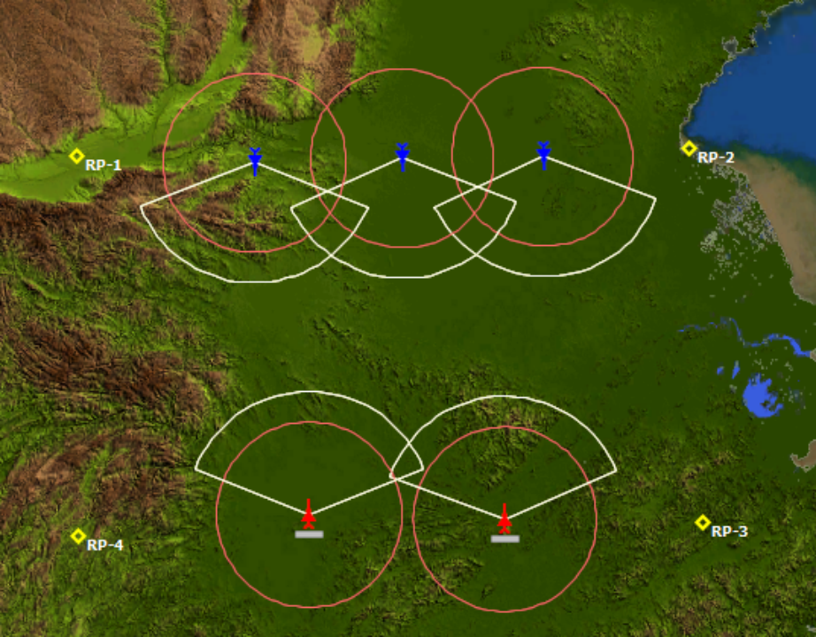
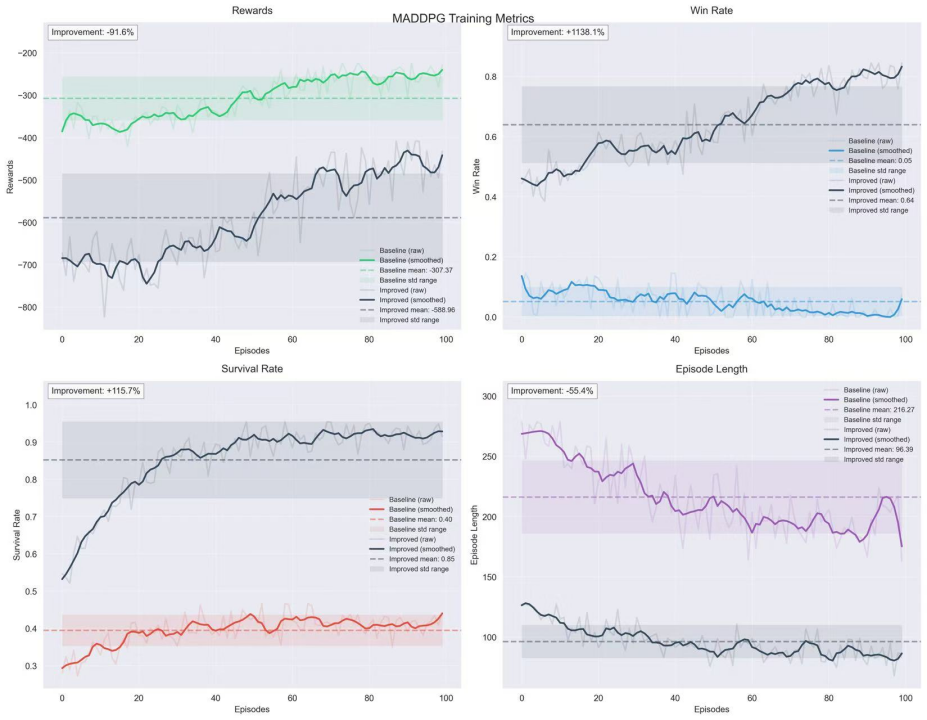

# UAV-Combat-MADDPG

## 项目描述
这是一个基于多智能体强化学习的多无人机对抗仿真系统，模拟了红蓝双方无人机的空战场景。系统以 MADDPG 算法为核心，结合动态博弈模型，实现了智能体的协同与对抗。

### 主要功能
- 支持多种对抗场景，包括不同数量和能力的无人机对抗。
- 仿真无人机的运动学模型，支持灵活的动作和策略。
- 可配置的攻击范围、命中概率等对抗参数。
- 灵活的奖励机制设计，支持不同策略的优化。
- 使用墨子平台进行仿真推演和结果可视化。

## 系统要求
- Python 3.8+
- PyTorch 1.8+
- NumPy
- PyYAML
- 墨子平台（可选）

---
## 使用说明
1. 克隆项目到本地：`git clone https://github.com/your_username/UAV-Combat-MADDPG.git`
2. 安装依赖包：`pip install -r requirements.txt`
3. 运行项目：`python main.py`

## 文件说明
- `main.py`：主程序入口，负责加载配置文件、创建环境、创建智能体、训练智能体等。同时启动两个训练器做对比仿真测试绘图。更多可以阅览这些：
  - [网络配置说明文档](network.md)
  - [主函数介绍说明文档](main.md)
  - [环境配置说明文档](env.md)
- `baseline_train.py`基础网络训练器
- `up_train.py`改进后的网络训练器
- `Version2/`大幅改进的异构无人机智能体算法，细节介绍可以阅读：
  - [Version2配置说明文档](./Version2/shuoming.md)
- `Version3/`接入墨子平台的部分，里面有对应的说明Markdown文件
  - [Version3配置说明文档](./Version3/mozi_train.md)
  - [Version3网络适配墨子平台配置说明文档](./Version3/envs/mozi_adapter.md)

## 注意事项
- 要使用墨子平台要把Version3放到对应的墨子AI_SDK文件夹下，IDE开到对应的整个SDK的根目录，能看到simu文件夹，同时想定也需要复制到Moziserver下一份储存想定。
- 运行前请先安装墨子平台，并配置好UP_MADDPG_MOZI/Version3/envs/env_config.py环境变量。指向你的墨子安装路径
- Version2加入了大量异构需要非常多的步骤来收敛，请耐心等待。
## 一些图

